# ESP32 Power Consumption Test

| Board                | Voltage [V] | Awake [mA] | Light Sleep [mA] | Deep Sleep [mA] |
| -------------------- | :---------: | :--------: | :--------------: | :-------------: |
| EzSBC ESP32-01       |         3.7 |       52.6 |              1.6 |         < 0.012 |
| EzSBC ESP32-01       |         5.0 |       53.1 |              1.6 |           0.012 |
| EzSBC ESP32-01       |        12.0 |       53.4 |              1.8 |           0.016 |
| LILYGO ESP32 OLED    |         5.0 |       64.5 |             10.8 |             9.4 |
| NodeMCU ESP-32S V1.1 |         5.0 |       64.6 |             13.8 |             4.7 |
| WEMOS LOLIN32 V1.0.0 |         3.7 |       55.7 |              2.0 |            0.13 |
| WEMOS LOLIN32 V1.0.0 |         5.0 |       57.3 |              3.1 |             1.2 |

## Test Setup

The test setup was powered with a lab power supply at 5.0 V, optionally at 3.7 V for rechargeable Li-ion batteries, or 12 V if the boards supports it. The current was measured both with a UNI-T UT61E multimeter in the mA range in series and with an oscillosope at an 1.00 &#937; series resistor. The voltage loss at the multimeter and the resistor is below 100 mV.

## Test Cycle

The program performs the following test cycle in `startup()`. It will be repeated infinitely:
* 4 seconds awake in `delayMicroseconds()` (WiFi/Bluetooth off)
* 4 seconds in light sleep
* 4 seconds in deep sleep

## Board Details

The oscilloscope shows 10 mA per division on Y, zero is at the bottom grid line. This cheap thing has a minor offset error of about +1.5 mA in the used 10 mV range on this channel which cannot be calibrated any better.

### EzSBC ESP32-01

This board is optimized for low power consumption while maintaining the ease-of-use of a development/breakout board with USB connector and even two RGB LEDs and push buttons on it. The deep sleep current can even be more improved as described on [EzSBC ESP32-01 Product Description](https://www.ezsbc.com/index.php/featured-products-list-home-page/wifi01-35.html#.XgMr_iHQhEY). Great quality from the US.

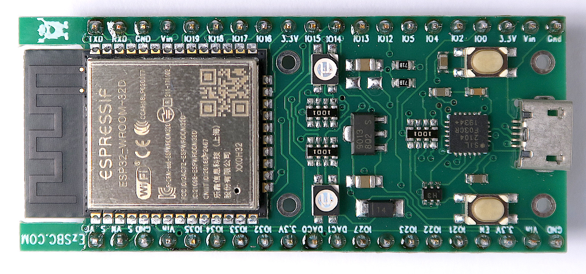

3.7 V

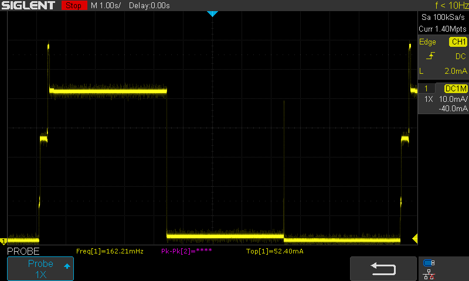

5.0 V

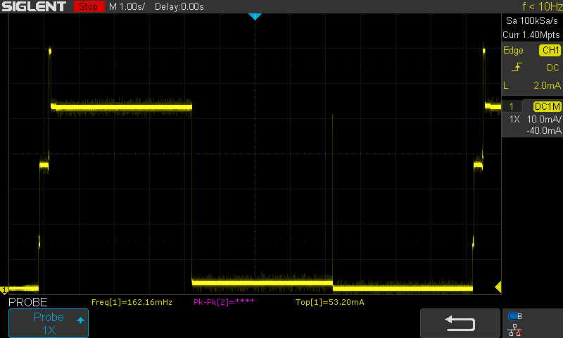

12 V

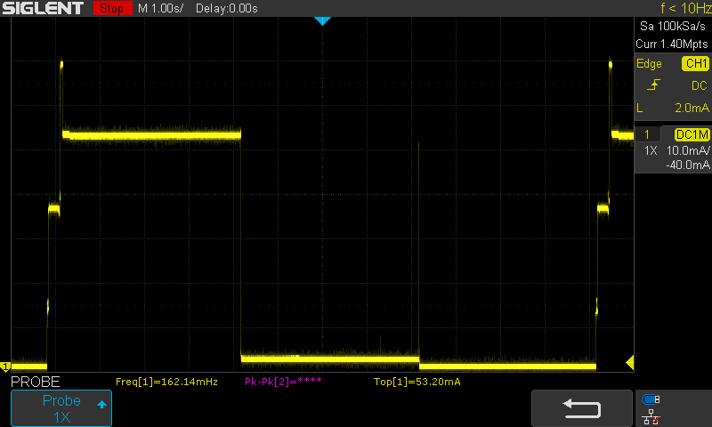

### LILYGO ESP32 OLED

A very useful board for development when a 128x64 pixel OLED display with SSD1306 controller is required.

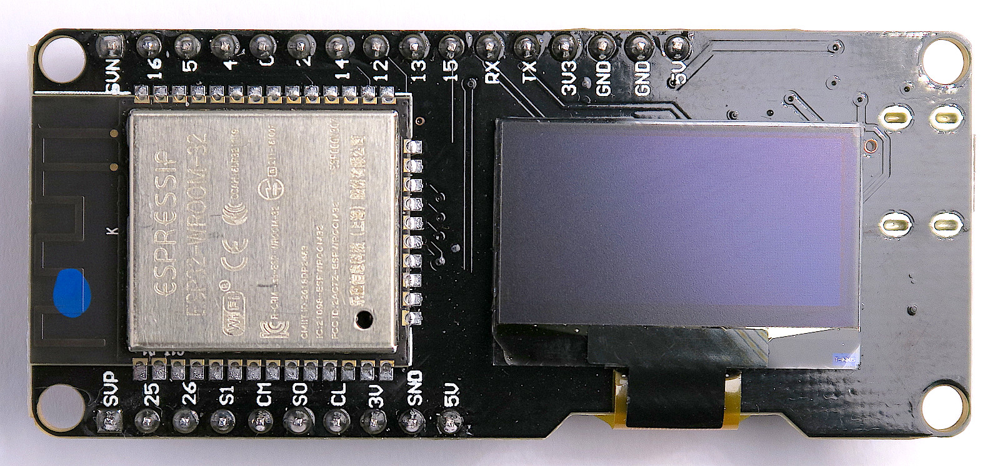

5 V

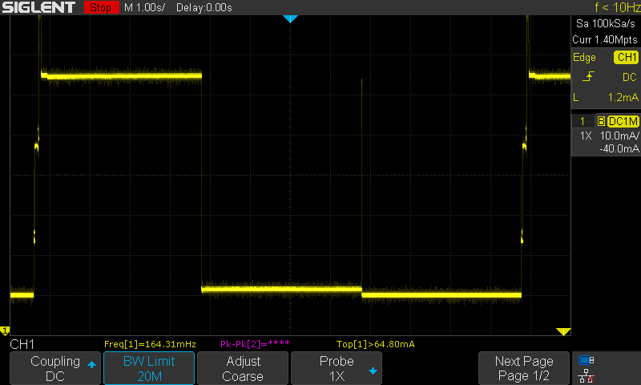

### NodeMCU ESP-32S V1.1

An older small board.

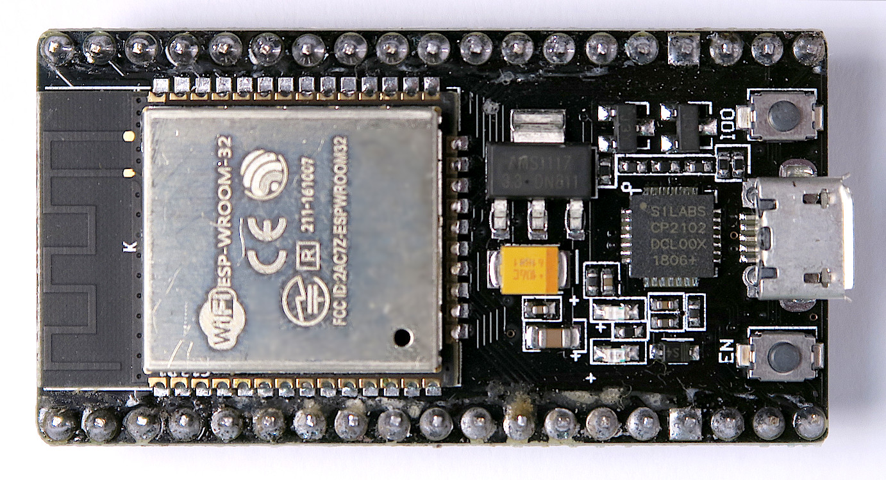

5 V

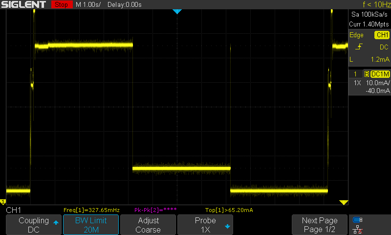

### WEMOS LOLIN32 V1.0.0

A solid older board with good low power characteristics and recharchable Li-ion battery support.

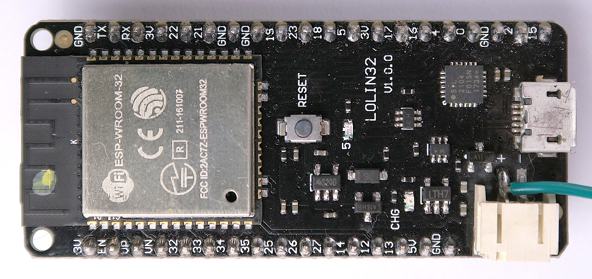

3.7 V

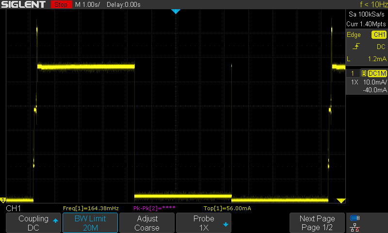

5 V

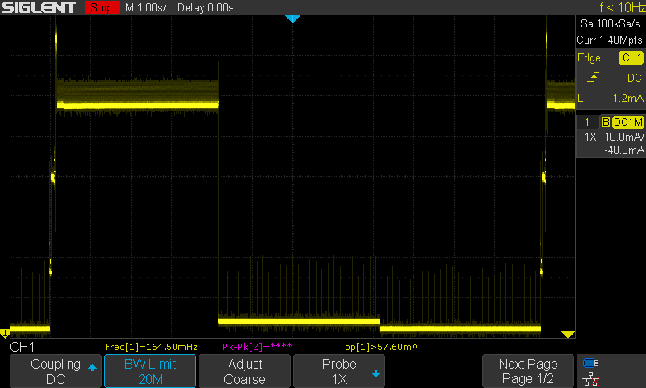

<meta name="google-site-verification" content="zchfavQzW_WYHCWxRwSlJxZlSK4ekHaJ_TdZg-IAJ6A" />
